# CRK (updating 2pm EST 21-November-2018)
# Happy Thanksgiving!!

Email contact: comamabb@gmail.com

Introduction
--------------------------------------

This repository includes a number of sections describing the analyses in the manuscript. The sections are

1. Mapping Using bowte2 
2. Pre-processing of Bulk cell data
3. Pre-processing of scRNA-seq data
4. Pre-processing of scATAC-seq data
5. The analysis of the data in the manuscript.

First, I am working on the point 5. Since the processed files are assumed to be available in point 5, point5 is goint to be finished first. I am sorry for the slow updating progress. It is becasue I am repeating every step of the analysis and trying to generating scripts that could be executed easier. <b> The initial version of point 5 is expteced to be finished on 21-November-2018 </b>. The "initial version" means that main figures could be generated using the scripts. A more detailed version and describtion would be provided afterwards.

After point5, then I will work on the other sections. That are how the processed data was generated.

A. Download files
--------------------------------------

1. Get the files from github and change directory to CRK

<pre>
[wlku@matrix] git clone https://github.com/wailimku/CRK.git
[wlku@matrix] cd CRK
[wlku@matrix CRK] ls
[wlku@matrix CRK] AdvancedColormap.m  <b>data</b>  <b>Figures</b>  <b>GSE105012</b>  README.md  <b>src</b> violin.m  violinplot.m
</pre>

2. Download the GSE105012.tar from GEO and put it into the folder  <b>GSE105012</b>
<pre>
[wlku@matrix CRK] cd GSE105012
[wlku@matrix GSE105012] ls
[wlku@matrix GSE105012] GSE105012.tar
[wlku@matrix GSE105012] tar -xvf GSE105012.tar
[wlku@matrix GSE105012] gunzip *.gz
[wlku@matrix GSE105012] cd ..
</pre>

B. H3K4me3 profiling  using low cell number 3T3 cells
--------------------------------------

1. Call peaks using SICER [1] for libraries using 3000, 1000, 300 and 100 cells. Peak files are savd in the directory './data/temp/Figure1/'
<pre>
[wlku@matrix CRK] sh ./src/figure1_code/script_sicer_low_cell
</pre>

2. Compute the TSS density profiles using HOMER [2] and plot the TSS profile plots using matlab (<b>Figure 1b</b>)
<pre>
[wlku@matrix CRK] sh ./src/figure1_code/script_run_homer_1
[wlku@matrix CRK] matlab -nodesktop
>> run ./src/Figure1_code/single_cell_3T3_tss_profile_plots(1,0)
</pre>

A figure (Figure 1b) is shown by matlab

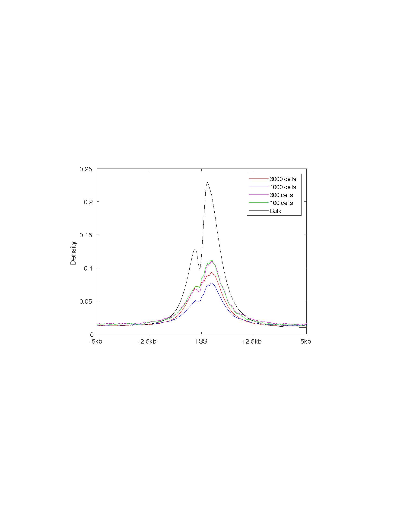

3. Plot the scatter plots between 3T3 bulk cell ChIP-data seq data and low cell number data
<pre>
[wlku@matrix CRK] Rscript ./src/Figure1_code/single_cell_analysze_H3K4me3_low_cell_num_scatter_bed2table.r
[wlku@matrix CRK] Rscript ./src/Figure1_code/single_cell_analysze_H3K4me3_low_cell_num_scatter_plot.r temp 1
[wlku@matrix CRK] cd Figures/Figure1/
[wlku@matrix Figure1] ls
[wlku@matrix Figure1] scatter_3T3_3000cell_at_H3K4me3_peaks_Fig1.pdf
[wlku@matrix Figure1] xpdf scatter_3T3_3000cell_at_H3K4me3_peaks_Fig1.pdf
</pre>

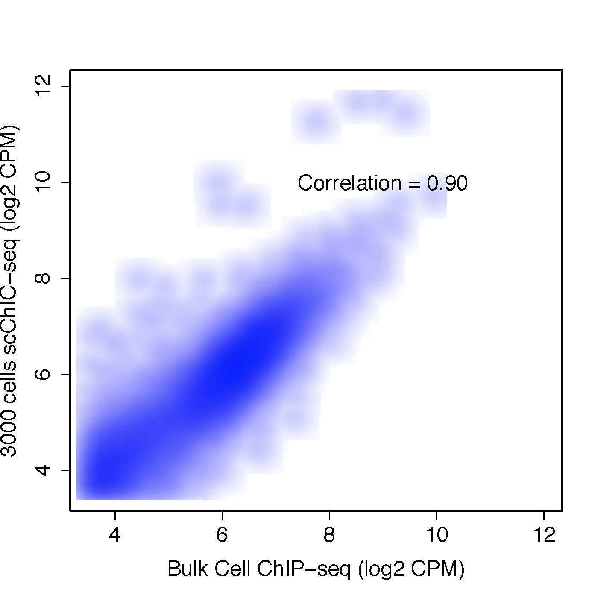

This is Figure 1d

4. Compute the peak overlap between Bulk Cell ChIP-seq and low cell number library
<pre>
[wlku@matrix Figure1] cd ../../
[wlku@matrix CRK] Rscript ./src/Figure1_code/peaks_overlap_for_3T3_cells.r 1
[1] "Bulk cell, number of peaks = "
[1] 16773
[1] "3000 cells scChIC-seq, number of peaks = "
[1] 16691
[1] "Overlap_peaks = "
[1] 13728
</pre>

5. Compute Clustering heatmap for 3T3, ESC, and Naive T cells
<pre>
[wlku@matrix CRK] matlab -nodesktop
>> run ./src/Figure1_code/analyze_H3K4me3_diff_cells_w_routput
</pre>

A figure (Figure 1e) is shown by matlab

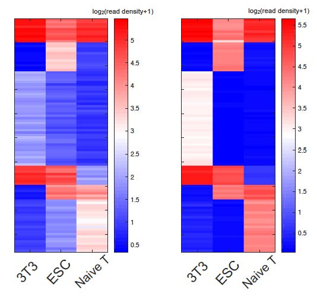

 

C. H3K4me3 profiling in Human white blood cells (WBCs)
---------------------------------------------------------

1. Before analyzing the WBC H3K4me3 data, we need to download the H3K4me3 ChIP-seq data from the ENCODE project. The file accession number can be obtained in <b>Supplemental Table S2</b>. Also, a number of pre-preprocessing steps for the Bulk WBC ChIP-seq data are required. In this version of pipeline, the processed data for human Bulk WBC ChIP-seq is provided. The general steps of pre-processing Bulk Cell data includes:
<ul>
	<ol type="a">
		<li>Do the mapping using Bowtie2 </li>
		<li>Remove redundant reads </li>
		<li>Combine all sicer peaks</li>
	</ol>
</ul>

2. Now, we analyze our WBC H3K4me3 data. First, we filter 4 large outliers and combined the other bed files.
<pre>
[wlku@matrix CRK] cd GSE105012
[wlku@matrix GSE105012] wc -l *_sc1_0_30_mapq10_noDup.bed|awk '{print $1"\t"$2}'|head -n 285> ../data/input/Figure2/wc_sc1_bed.txt
[wlku@matrix GSE105012] cd ..
[wlku@matrix CRK] matlab -nodesktop
>> run ./src/Figure2_code/single_cell_H3k4me3_filter_large_outlier
>> exit
[wlku@matrix CRK] cd GSE105012
[wlku@matrix GSE105012] sh script_cat_sc
[wlku@matrix GSE105012] cd ..
</pre>

3. The bedgrapgh file for the pooled cells (281 cells) is generated. This bedgraph files could be uploaded to genome browser for visualization.
<pre>
[wlku@matrix CRK] ./generateRPBMBasedSummary ./GSE105012/combined_sc_white_blood_cell.bed hg18_chrlen.txt 1000 75 n ./GSE105012/combined_sc_white_blood_cell.bedgraph 
</pre>

4. Call peaks for the pooled cells using SICER [1], and compute the overlaps of peaks between bulk and pooled cells
<pre>
[wlku@matrix CRK] sh ./src/Figure2_code/script_poolsc_sicer
[wlku@matrix CRK] Rscript ./src/Figure2_code/peakoverlap_bulk_poolsc_H3k4me3.r 
[1] "Bulk wbc cell, number of H3K4me3 peaks = "
[1] 52798
[1] "Pooled cells, number of H3K4me3 peaks = "
[1] 24819
[1] "Overlap_peaks = "
[1] 15034
</pre>

5. Plot TSS profiles plot (<b>Figure 2b</b>)
<pre>
[wlku@matrix CRK] sh ./src/Figure2_code/script_homer_sctss
[wlku@matrix CRK] matlab -nodesktop
>> run ./src/Figure2_code/scTSS_plot.m
>> exit
</pre>

A figure (Figure 2b) is shown by matlab

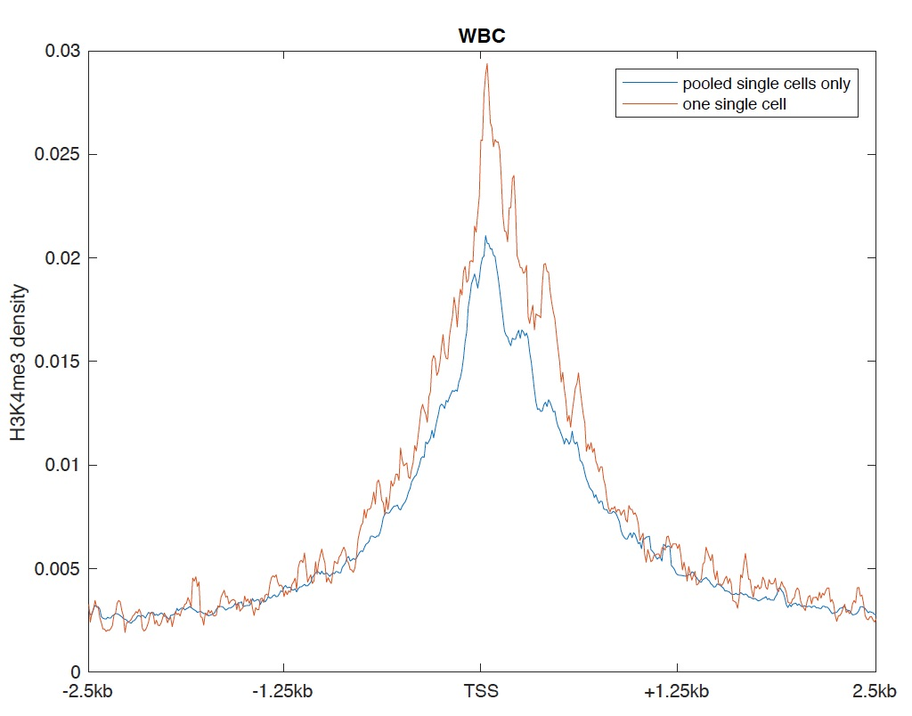

6. Read filtering. Since read filtered files can be downloaded from GSE105012, so this step is optional.
<pre>
[wlku@matrix CRK] mkdir ./data/temp/Figure2/filtered_bed
[wlku@matrix CRK] cd GSE105012
[wlku@matrix GSE105012] ls  *sc1_0_30_mapq10_noDup.bed|awk '{print "cp "$1" "$1".txt"}'>script_cp_bed2txt
[wlku@matrix GSE105012] sh script_cp_bed2txt
[wlku@matrix GSE105012] cd ..
[wlku@matrix CRK]  matlab -nodesktop
>> run ./src/Figure2_code/singlecell_filtereads_by_poolscpeak.m
>> exit
</pre>

7. Plot scatter plots between pooled cells and bulk cells
<pre>
[wlku@matrix CRK] mkdir ./data/temp/Figure2/filtered_bed/sel_242_bed
[wlku@matrix CRK] less ./data/temp/Figure2/sel_242_file.txt|awk '{print "cp ./data/temp/Figure2/filtered_bed/"$1 " ./data/temp/Figure2/filtered_bed/sel_242_bed"}' > ./src/Figure2_code/script_cp_242_bed 
[wlku@matrix CRK] sh ./src/Figure2_code/script_cp_242_bed
[wlku@matrix CRK] Rscript ./src/Figure2_code/single_cell_plot_scatter_plots_between_pool_bulk_bed2table.r
[wlku@matrix CRK] Rscript ./src/Figure2_code/single_cell_plot_scatter_plots_between_pool_bulk.r
[wlku@matrix CRK] xpdf ./Figures/Figure2/scatter_bulk_pooledsc_at_H3K4me3peaks.pdf
</pre>

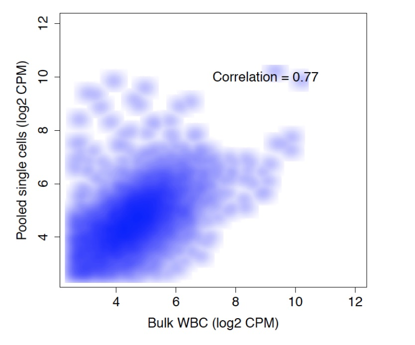

This is Figure 2d

8. Calculation of precision and sensitivity

<pre>
 [wlku@matrix CRK] matlab -nodesktop
 >> run ./src/Figure2_code/generate_pre_sen.m
 >> exit
</pre>

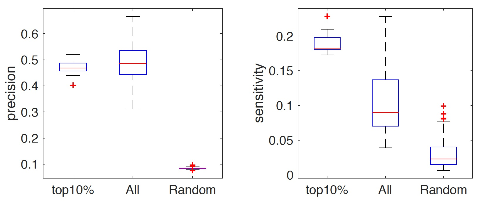

D. Cell clustering of human WBCs
---------------------------------------------------------

1. To do the cell clustering, we first do the ScImpute. Batch effect is removed using the non-negative matrix factoriation (nnmf). Finally, the software SC3 was applied for cell clustering. All the script are included in ./src/Figure3_code/ . Here, the corected matrix and the output of SC3 used in the manuscript are provided in ./data/input/Figure3/. 

2. Visulization of Concensus matrix and assign cell types to clusters
<pre>
 [wlku@matrix CRK] matlab -nodesktop
 >> run ./src/Figure2_code/single_cell_annotate_cluster_to_celltype.m
</pre>

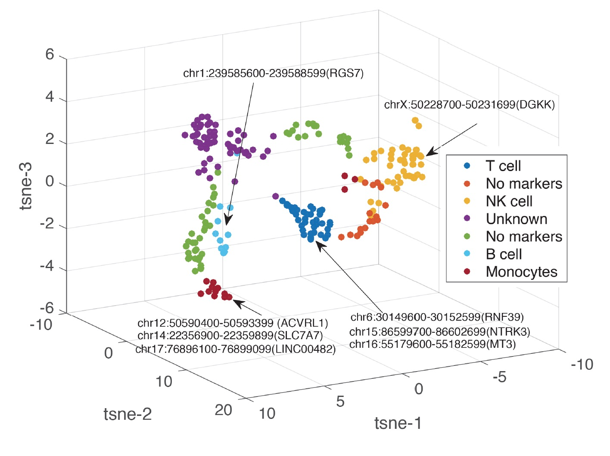

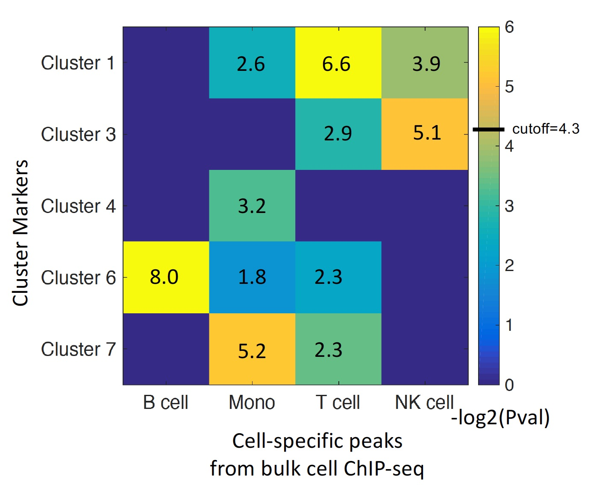

E. Gene expression and H3K4me3
---------------------------------------------------------

<pre>
[wlku@matrix CRK] cd src/Figure4_code
[wlku@matrix Figure4_code] matlab -nodesktop
>> single_cell_analyze_corr_scRNA_in_concen_mat2(1,1,4,5.3)
</pre>

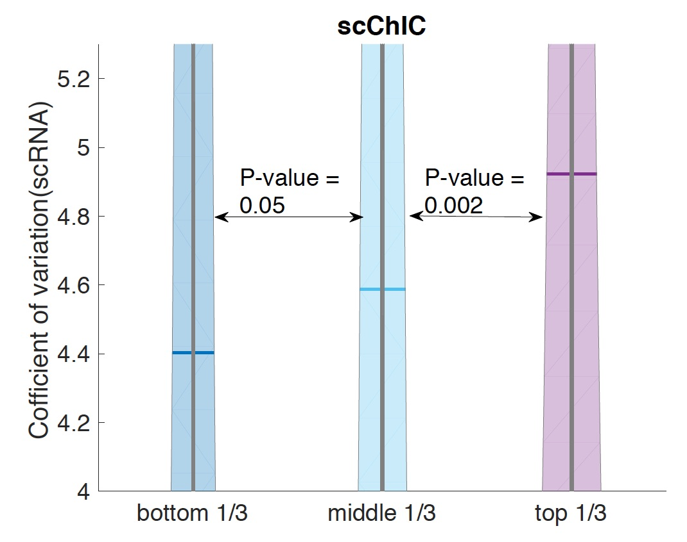

<pre>
>> single_cell_analyze_corr_scRNA_in_concen_mat2(1,2, 0.5, 0.6)
</pre>

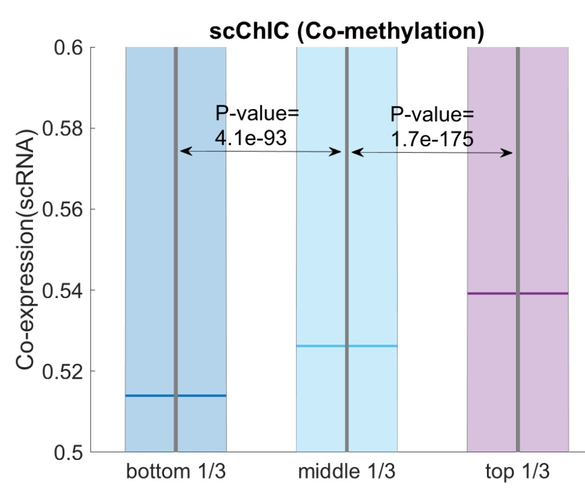

	
<pre>
>> single_cell_analyze_impute_readcount2(1)
</pre>

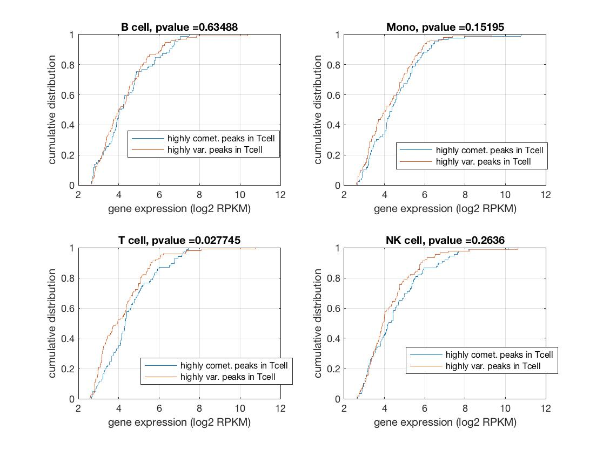

	
<pre>
>> single_cell_analyze_impute_readcount2(2)
</pre>

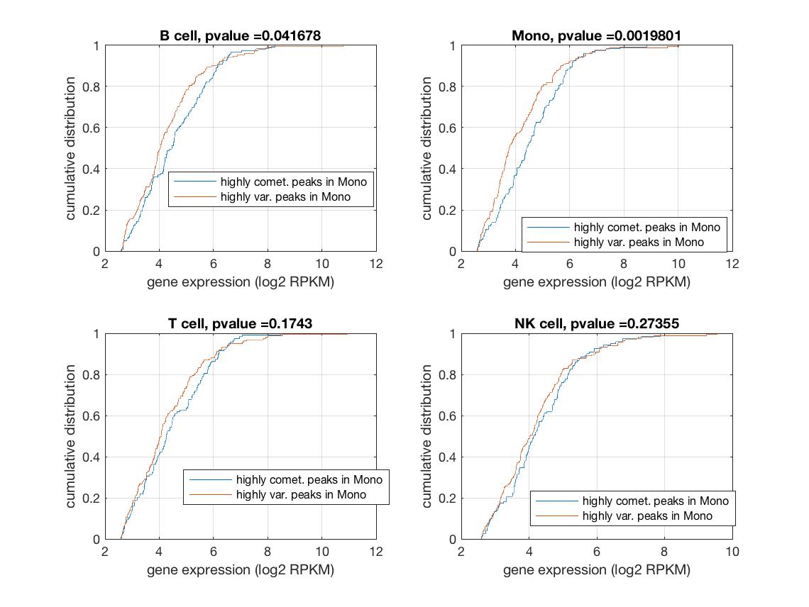

	

F. Finding the enriched TFs
---------------------------------------------------------

1. Selection of the two peak sets
<pre>
>> cd ../Figure5_code
>> run single_cell_analyze_impute_readcount_conet_tcell3
>> run single_cell_analyze_impute_readcount_conet_mono3
>> exit
[wlku@matrix Figure4_code] cd ..
</pre>

2. Perform the chromvaranalysis
<pre>
[wlku@matrix CRK] Rscript ./src/Figure5_code/single_cell_chromVar_analysze_scH3K4me3_cluster_peak_tcell2.r 
[wlku@matrix CRK] Rscript ./src/Figure5_code/single_cell_chromVar_analysze_scH3K4me3_cluster_peak_mono2.r

</pre>

3. examine the enriched TFs and their gene expression level
<pre>
[wlku@matrix CRK] matlab -nodesktop
>> cd src/Figuere5_code/
>> single_cell_analyze_chromvar_deviation_Tcell2(1)
</pre>

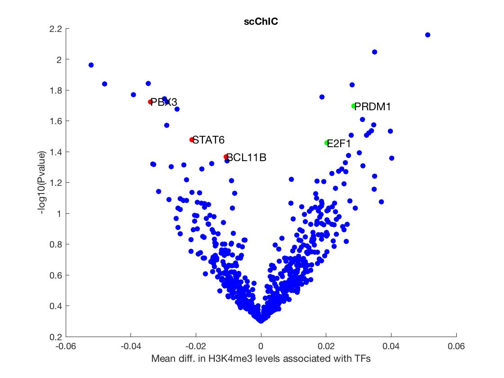

		
<pre>
>> single_cell_analyze_chromvar_deviation_Tcell2(2)
</pre>

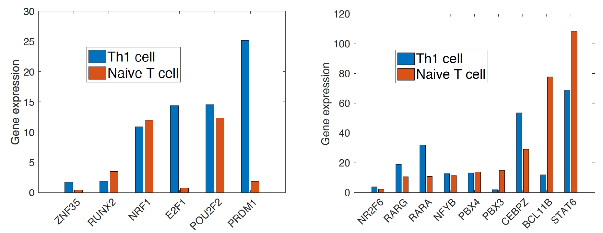

<pre>
>> 
>> single_cell_analyze_chromvar_deviation_mono2(1)
</pre>

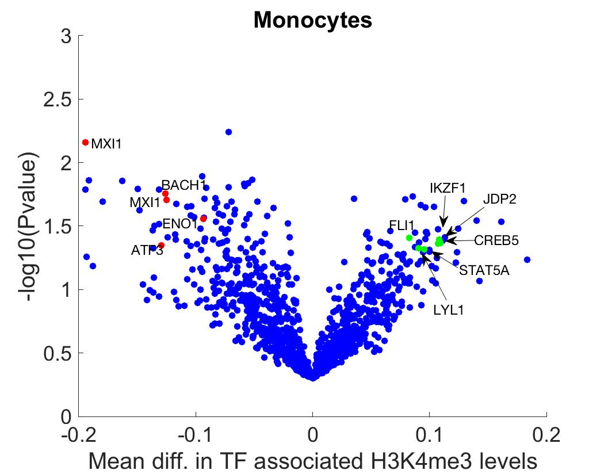

		
<pre>
>> single_cell_analyze_chromvar_deviation_mono2(2)
</pre>

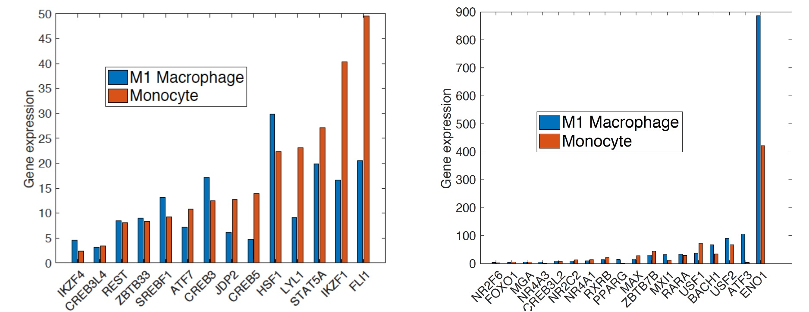

G. H3K27me3 profiling in human WBCs
---------------------------------------------------------
1. 
<pre>
[wlku@matrix CRK] cd GSE105012
[wlku@matrix GSE105012] cat *_IB2_0_30_mapq10_noDup.bed > H3K27me3_combined_106.bed
[wlku@matrix GSE105012] ../generateRPBMBasedSummary H3K27me3_combined_106.bed ../hg18_chrlen.txt 1000 75 n H3K27me3_combined_106.bedgraph 
[wlku@matrix GSE105012] cd ..
</pre>

2. Overlap of peaks
<pre>
[wlku@matrix CRK] sh ./src/Figure6_code/script_poolsc_sicer
[wlku@matrix CRK] Rscript ./src/Figure6_code/peak_overlap_analysze_scH3K27me3.r
[1] "Bulk wbc cell, number of H3K27me3 peaks = "
[1] 36224
[1] "Pooled cellss number of H3K27me3 peaks = "
[1] 21465
[1] "Overlap_peaks = "
[1] 10730
</pre>

3.
<pre>
[wlku@matrix CRK] cd GSE105012
[wlku@matrix GSE105012] ls *_IB2_0_30_mapq10_noDup.bed|awk '{print "cp "$1" "$1".txt"}'>script_cp_bed2txt
[wlku@matrix GSE105012] sh script_cp_bed2txt
[wlku@matrix GSE105012] cd ..
[wlku@matrix CRK] mkdir data/temp/Figure6/filtered_bed
[wlku@matrix CRK] cd /data/temp/Figure6/filtered_bed
[wlku@matrix filtered_bed] wc -l *.txt|awk '{print $1"\t"$2}'|head -n 106 >../sel_filterlist_106.txt
[wlku@matrix filtered_bed] cd ../../../..
[wlku@matrix CRK] matlab -nodesktop
>> run ./src/Figure6_code/singlecell_filter_reads_by_peak_H3K27me3
>> exit
[wlku@matrix CRK] Rscript ./src/Figure6_code/single_cell_analysze_scH3K27me3_using_chromvar2.r
[wlku@matrix CRK] xpdf ./Figures/Figure6/
</pre>

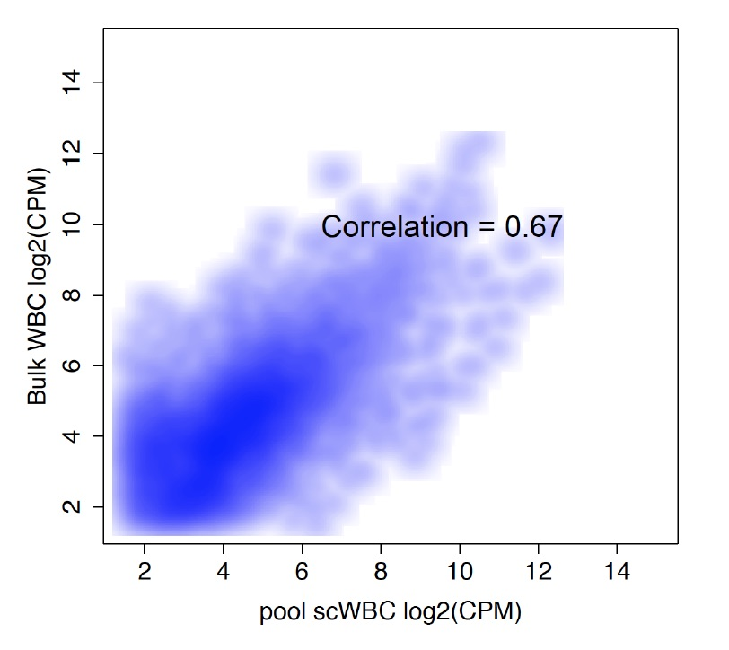

<pre>
</pre>

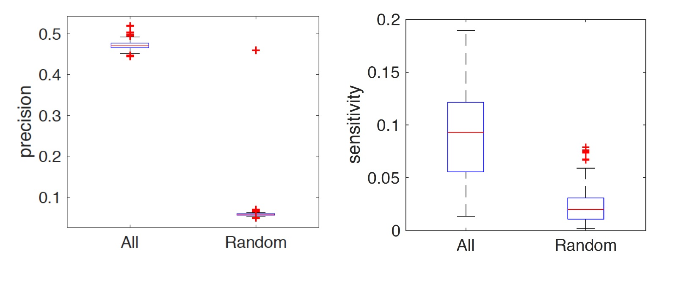

I. References:
--------------------------------------

1. Zang, C. et al. A clustering approach for identification of enriched domains from histone modification ChIP-Seq data. Bioinformatics 25, 1952-1958, doi:10.1093/bioinformatics/btp340 (2009).
2. Heinz S, Benner C, Spann N, Bertolino E et al. Simple Combinations of Lineage-Determining Transcription Factors Prime cis-Regulatory Elements Required for Macrophage and B Cell Identities. Mol Cell May 28;38(4):576-589 (2010).
